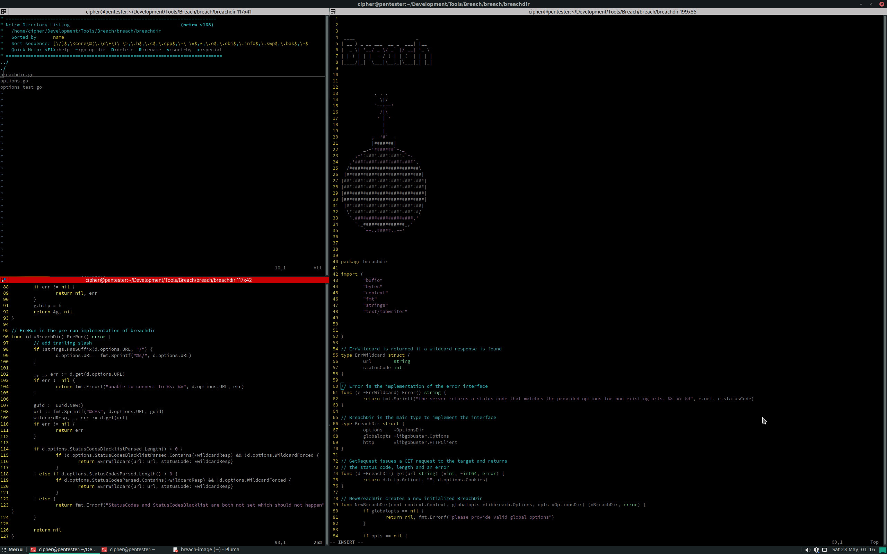

# Breach

# Description

Creating a tool called Breach that breaches directories on the web. follow my progress on my TODO List.

Each will have a main category for example 

* [ ] BreachDir

And then a script category related to the main category example

* [ ] BreachDir
	* [ ] breachdir.go

And then a sub category with points this means it needs implementing 

* [ ] BreachDir
	* [ ] breachdir.go
		* ErrWildcard is returned if a wildcard response is found

Once Completed i will mark each points off like so

* [x] ErrWildcard is returned if a wildcard response is found

#
#### Please Note:

There will be more added to the TODO List this should be enough to get me going :)

also DO NOT USE my tool for bad things please get permission off the person you are testing against.

#

## TODO LIST

* [ ] BreachDir
	* [ ] breachdir.go
		* ErrWildcard is returned if a wildcard response is found
		* Error is the implementation of the error interface
		* BreachDir is the main type to implement the interface
		* GetRequest issues a GET request to the target and returns
 the status code, length and an error
		* NewBreachDir creates a new initialized BreachDir
		* PreRun is the pre run implementation of breachdir
			* add trailing slash
		* Run is the process implementation of breachdir
			* Try the DIR first
			* Follow up with files using each ext
		* ResultToString is the to string implementation of breachdir
			* Prefix if we're in verbose mode
		* GetConfigString returns the string representation of the current config

	 * [ ] options.go
		* OptionsDir is the struct to hold all options for this plugin
		* NewOptionsDir returns a new initialized OptionsDir

* [ ] BreachDNS 

